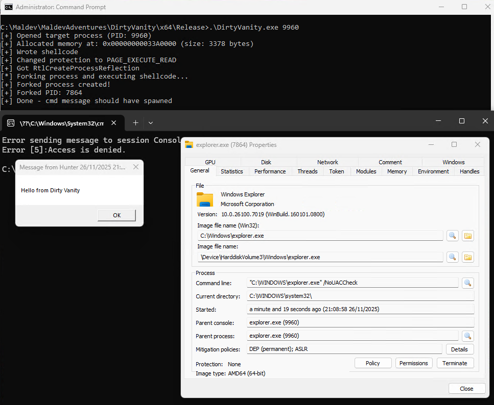

# Dirty Vanity PoC

Process reflection-based code injection via `RtlCreateProcessReflection`.

## Overview

**Dirty Vanity** exploits the undocumented `RtlCreateProcessReflection` API from ntdll to create a forked clone of a target process and execute arbitrary shellcode within that cloned context. This is a form of **process hollowing via reflection**.

## Mechanism

1. Opens a target process (e.g., `explorer.exe`)
2. Allocates memory in the target and writes shellcode
3. Calls `RtlCreateProcessReflection` with the shellcode entry point
4. ntdll forks the process—creating a new cloned instance
5. Shellcode executes in the forked process context
6. Spawns `cmd.exe /k msg * "Hello from Dirty Vanity"`


## Usage

```cmd
dirty_vanity.exe <target_pid>
```

## What Happens

- New `explorer.exe` process spawns (forked clone)
- Message box displays: `"Hello from Dirty Vanity"`
- Original explorer remains unaffected
- Forked explorer runs the injected shellcode

## Shellcode

The embedded shellcode:
- Dynamically resolves kernel32, ntdll functions
- Loads `LoadLibraryA`, `RtlCreateProcessParametersEx`, `NtCreateUserProcess`
- Constructs command line: `C:\Windows\System32\cmd.exe /k msg * Hello from Dirty Vanity`
- Spawns the process and suspends the injected thread


## References

- https://github.com/deepinstinct/Dirty-Vanity/tree/main
- https://blackhat.com/eu-22/briefings/schedule/index.html#dirty-vanity-a-new-approach-to-code-injection--edr-bypass-28417
- https://www.deepinstinct.com/blog/dirty-vanity-a-new-approach-to-code-injection-edr-bypass


